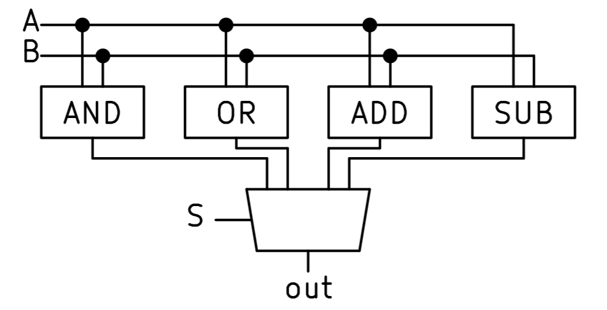

#digital #electronics #computer_architecture 

Arithmetic Logic Unit is the basic execution unit of [[Central_Processing_Unit]]. It performs: [[Binary_Adder|Addition/Subtraction]], [[Logic_Gate|Logic Operations]], and sometimes [[Binary_Multiplication|Multiplication]] and [[Binary_Division|Division]].  ALU is simply a [[Multiplexer|Mux]] between these operations.

Sometimes these internal computations consume too much [[Power]], in that case  additional logic can be implemented to reduce it, at a cost of reduced speed.

ALUs may output [[CPU_Flag|CPU Flags]].

 
Simple ALU implementation

## Lectures
- CS61C - UCB 

#lecture_cs61c_ucb