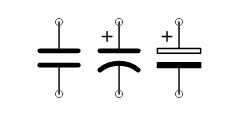
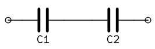
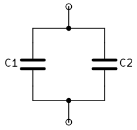

#electronics #circuit 

A Capacitor is an [[Electronics|Electronic]] component representing the concept of [[Capacitance]].
A capacitor obeys the equation $I = C \frac{dV}{dt}$ or equivalently $Q = CV$

## Symbols

 
Capacitor symbols, first one is unpolarized.

## In Series

 

As there is a part of isolated wire in the middle, any charge stored on $C_1$ has to come from $C_2$ and vice versa.
Therefore $Q_1 = Q_2 = Q$.
Since $Q = C_1 V_1$ and $Q = C_2 V_2$, $V_1 = \frac{Q}{C_1}$ and $V_2 = \frac{Q}{C_2}$.
Total [[Voltage]] is then $V = V_1 + V_2 = \left(\frac{1}{C_1} + \frac{1}{C_2}\right)Q$.
So finally $Q = \frac{1}{\frac{1}{C_1} + \frac{1}{C_2}}V$, in other words $\frac{1}{C_{eq}} = \frac{1}{C_1} + \frac{1}{C_2}$.
And so inverses of capacitances add up.

## In Parallel

 

As there cannot be [[Voltage]] across a [[Wire]], $V_1 = V_2 = V$ (the actual reference point does not matter).
Total [[Charge]] stored on the first capacitor is $Q_1 = C_1 V$ and on the second $Q_2 = C_2 V$.
Total charge stored on both capacitors is $Q_t = Q_1 + Q_2 = C_1 V + C_2 V = (C_1 + C_2)V$
Therefore let $C_{eq} = C_1 + C_2$ then $Q_t = C_{eq} V$.
And so capacitances in parallel add up.

## Parameters
- nominal [[Voltage]] - ???
- losses - $I_{series resistance} / I_{capacitor}$ in [[Phasor]]
- tolerance - maximum deviation from nominal [[Capacitance]]
- [[Capacitance]]

## Applications
- [[Analog_Integrator|Analog Integrator]]
- [[Analog_DIfferentiator|Analog Differentiator]]
- [[Decoupling_Capacitor|Decoupling Capacitor]]
- [[ACDC_Converter|AC-DC Converters]]
- [[DCAC_Converter|DC-AC Converters]]
- [[Energy]] storage
- [[Analog_Signal_Processing|Analog Signal Processing]]

## Types
In general, any shape is possible, but some are more used than the others.

by construction
- [[Parallel_Plate_Capacitor|Parallel Plate Capacitor]]

## TODO
- write about types, segregate them
- real model