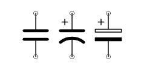
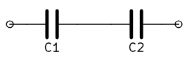
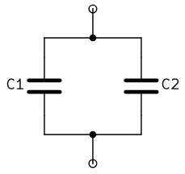

#electronics #circuit 

A Capacitor is a two terminal [[Electronics|Electronic]] component representing the concept of [[Capacitance]].
A capacitor obeys the equation $I = C \frac{dV}{dt}$ or equivalently $Q = CV$

## Symbols

 
Capacitor symbols, first one is unpolarized.

## In Series

 

As there is a part of isolated wire in the middle, any charge stored on $C_1$ has to come from $C_2$ and vice versa.
Therefore $Q_1 = Q_2 = Q$.
Since $Q = C_1 V_1$ and $Q = C_2 V_2$, $V_1 = \frac{Q}{C_1}$ and $V_2 = \frac{Q}{C_2}$.
Total [[Voltage]] is then $V = V_1 + V_2 = \left(\frac{1}{C_1} + \frac{1}{C_2}\right)Q$.
So finally $Q = \frac{1}{\frac{1}{C_1} + \frac{1}{C_2}}V$, in other words $\frac{1}{C_{eq}} = \frac{1}{C_1} + \frac{1}{C_2}$.
And so inverses of capacitances add up.

## In Parallel

 

As there cannot be [[Voltage]] across a [[Conductor]], $V_1 = V_2 = V$ (the actual reference point does not matter).
Total [[Charge]] stored on the first capacitor is $Q_1 = C_1 V$ and on the second $Q_2 = C_2 V$.
Total charge stored on both capacitors is $Q_t = Q_1 + Q_2 = C_1 V + C_2 V = (C_1 + C_2)V$
Therefore let $C_{eq} = C_1 + C_2$ then $Q_t = C_{eq} V$.
And so capacitances in parallel add up.

## Parameters
- nominal [[Voltage]] - ???
- losses - $I_{series resistance} / I_{capacitor}$ in [[Phasor]]
- tolerance - maximum deviation from nominal [[Capacitance]]
- [[Capacitance]]

## Applications
- [[Analog_Signal_Processing|Analog Signal Processing]]
- Decoupling 
- [[Power_Supply|Power Converters]]
- [[Energy]] storage

## Types
In general, any shape is possible, but some are more used than the others.

by Construction
- [[Parallel_Plate_Capacitor|Parallel Plate Capacitor]]

by Material
- Electrolytic
  Aluminium foil with liquid electrolyte
  Generally only for large capacitance
  
  Can explode, degrade over time, polarized (can be connected back to back to remove this polarization)
- Tantalum
  
  Reliable within spec, low leakage
  Expensive, flammable
- Film 
  
  High capacitance
- Mains
  
  For power supplies interacting with mains power.
- Ceramic
  Ubiquitous, cheap, wide range of parameters 

  Can act as a microphone and speaker

## Frequency Response

![[Capacitor_Impedance-Frequency.png]]

## Transient Response
![[Capacitor_Transient.png]]

## Power Applications
Smaller capacitors in parallel are often needed  to meet specs.
- Capacitance
  Minimizing ripple voltage
- Physical Size
  Bigger capacitors are generally taller
- ESR
  Capacitors in parallel minimize ESR
- Cost
  Smaller capacitors are cheaper
- BOM reuse
  Somewhere else in the design smaller caps are more likely to be already used
- Product config
- Longer life
  Less heating up 
- Redundancy
  If one fails the product still works
- Peak currents
  Less peak currents requirements, each capacitor can have separate trace

## Decoupling Capacitor
Decoupling Capacitor is a [[Capacitor]] used to smooth out [[Signal]] or [[Power]] delivered, mostly by functioning like [[Analog_Signal_Processing#Low Pass Filter|Low Pass Filter]].

## Videos
- [EEVblog 33 - Capacitor Tutorial p1](https://www.youtube.com/watch?v=xlvqUts9H9c)
- [EEVblog 33 - Capacitor Tutorial p2](https://www.youtube.com/watch?v=TDDoi70cxw0)
- [EEVblog 486 - Does Current Flow Through Capacitor](https://www.youtube.com/watch?v=ppWBwZS4e7A)
- [EEVblog 742 - Why Electrolytic Capacitors are Connected in Parallel](https://www.youtube.com/watch?v=wwANKw36Mjw)

#video_eevblog

%%
## TODO
- write about types, segregate them
- real model
- check ceramic capacitor audio generation
- schematics
- design considerations