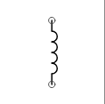
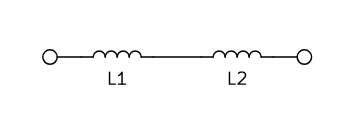
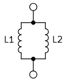

#electronics 

An Inductor is an [[Electronics|Electronic]] component representing the concept of [[Inductance]].
An Inductor obeys the equation $V = L \frac{dI}{dt}$

## Symbols

 
Inductor Symbol

## In Series

 

As they are in series, they must share [[Current]] so $V_1 = L_1 \frac{dI}{dt}$ and $V_2 = L_2 \frac{dI}{dt}$.
Then $V = V_1 + V_2 = L_1 \frac{dI}{dt} + L_2 \frac{dI}{dt}$.
So $V = (L_1 +  L_2) \frac{dI}{dt}$ and so $L_eq = L_1 + L_2$.

## In Parallel

 

As they are in parallel, they must share [[Voltage]] so $V = L_1 \frac{d I_1}{dt}$ and $V = L_2 \frac{d I_2}{dt}$.
Then $d I_1 = \frac{V}{L_1} dt$ and $d I_2 = \frac{V}{L_2}$
Integrating both sides $I_1 = \frac{\int V dt}{L_1}$ and $I_2 = \frac{\int V dt}{L_2}$ (note that voltage changes over time, so we cannot just write $\frac{V}{L}$).
The total current is then $I = I_1 + I_2 = \frac{\int V dt}{L_1} +  \frac{\int V dt}{L_2} = \left(\frac{1}{L_1} + \frac{1}{L_2}\right) \int V dt$.
Differentiating we get $\frac{dI}{dt} = \left(\frac{1}{L_1} + \frac{1}{L_2}\right) V$ 
And finally $V = \frac{1}{\frac{1}{L_1} + \frac{1}{L_2}} \frac{dI}{dt}$ so $\frac{1}{L_{eq}} = \frac{1}{L_1} + \frac{1}{L_2}$ 

## TODO
- write about types