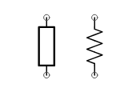
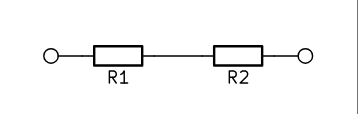
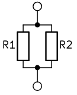

#electronics 

A resistor is an [[Electronics|Electronic]] component representing the concept of [[Resistance]], its more generalized version is [[Impedance]]. 
Typically, resistor refers to [[Linearity|Linear]] resistor obeying [[Ohms_Law|Ohm's Law]]  $V = IR$.

## Symbols

 
Resistor Symbols

## In Series

 

As they are in series, they must share [[Current]] so $V_1 = IR_1$ and $V_2 = IR_2$.
Then $V = V_1 + V_2 = IR_1 + IR_2 = I(R_1 + R_2)$
And so $R_{eq} = R_1 + R_2$.

## In Parallel

 

As they are in series, they must share [[Voltage]] so $V = I_1R_1$ and $V = I_2R_2$.
So $I_1 = \frac{V}{R_1}$ and $I_2 = \frac{V}{R_2}$
Total current is then $I = I_1 + I_2 = \frac{V}{R_1} + \frac{V}{R_2}$
And so $V = \frac{1}{\frac{1}{R_1} + \frac{1}{R_2}}I$ so $\frac{1}{R_{eq}} = \frac{1}{R_1} + \frac{1}{R_2}$.

## TODO
write about types