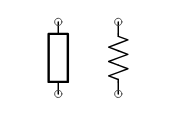
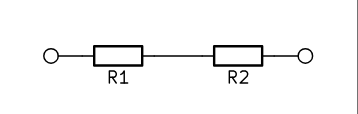
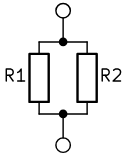

#electronics 

A resistor is a passive (consumes power) two [[Electronic_Device#Terminal|Terminal]] [[Electronic_Device|Electronic Device]] representing the concept of [[Resistance]], of which the more generalized version is [[Impedance]]. 
Typically, "resistor" refers to [[Linearity|Linear]] resistor obeying [[Ohms_Law|Ohm's Law]]  $V = IR$.
A resistor primary purpose is to limit the [[Charge|Current]] or to dissipate [[Power]] (for example in [[Heat|Heaters]])

## Symbols

 
Resistor Symbols

## In Series

 

As they are in series, they must share [[Charge|Current]] so $V_1 = IR_1$ and $V_2 = IR_2$.
Then $V = V_1 + V_2 = IR_1 + IR_2 = I(R_1 + R_2)$
And so $R_{eq} = R_1 + R_2$.

## In Parallel

 

As they are in series, they must share [[Voltage]] so $V = I_1R_1$ and $V = I_2R_2$.
So $I_1 = \frac{V}{R_1}$ and $I_2 = \frac{V}{R_2}$
Total current is then $I = I_1 + I_2 = \frac{V}{R_1} + \frac{V}{R_2}$
And so $V = \frac{1}{\frac{1}{R_1} + \frac{1}{R_2}}I$ so $\frac{1}{R_{eq}} = \frac{1}{R_1} + \frac{1}{R_2}$.

## Parameters
- nominal resistance - specified value
- nominal [[Power]] - the power that can be dissipated as [[Heat]] without damaging the resistor
- acceptable [[Voltage]] - a range where resistor works
- [[Tolerance]] - possible deviation from nominal value
- [[Noise]] coefficient - ???
- physical size
- [[Temperature]] Coefficient of Resistance (TCR) 

## Marking
- Color code
- Letter-Number code
- Number code

## Standardized Values

## Types
### Function
- constant value
- regulated value - [[#Potentiometer|Potentiometer]]
- semiconductor
### Characteristic
- [[Linearity|Linear]]
- non-Linear
## Construction
- Wired Resistor
- Layered Resistor
- Bulk Resistor

## Real Resistor Model

## Potentiometer
A Potentiometer is an adjustable [[Resistor]]

### Symbols

### Construction

Track with relatively high [[Resistance]] is connected by moving [[Conductor]] to another end. By moving the conductor, larger (or smaller) part of the track has to be traversed by [[Charge|Current]], increasing (or decreasing) resistance.
As the track can be made from any material or with any width,  there is no limit on maximum current or shape of the function, other than [[Monotonic|Monotonically]] non decreasing.

### Application
For any [[Voltage]] controlled element, can easily create [[Voltage_Divider|Voltage Divider]]

%%
## TODO
write about types
marking example
example in each function
describe standardized values
schematic of real resistor
application section

for potentiometer:
symbol
construction images
schematics